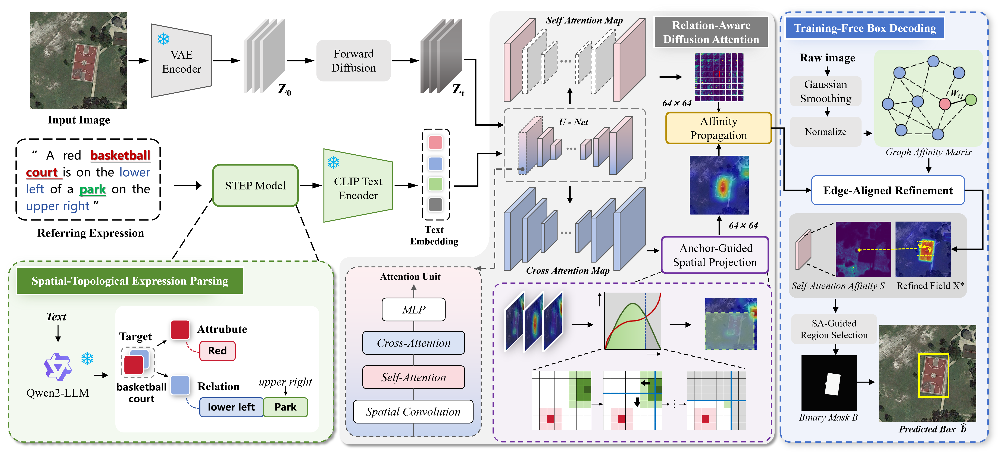
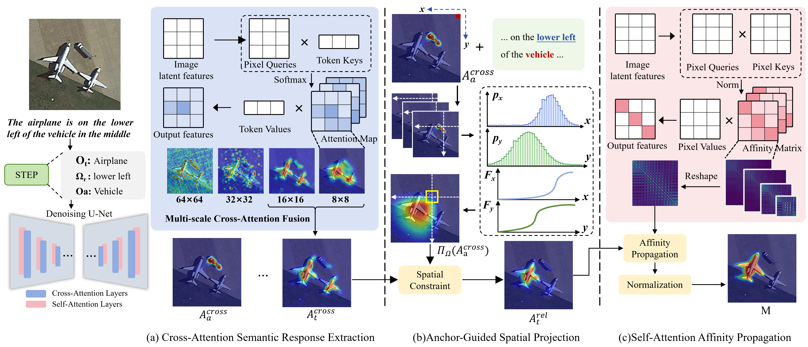

# Zero-Shot Open-Vocabulary Visual Grounding via Diffusion-Based Spatial-Topological Routing in Remote Sensing Images


This is the offical repo for paper **"Zero-Shot Open-Vocabulary Visual Grounding via Diffusion-Based Spatial-Topological Routing in Remote Sensing Images"**. 

**Lab**: 智能感知与图像理解教育部重点实验室

**Authors**: Puhua Chen , Xuqiang Cao , Shasha Mao , Yuwei Guo , Jiadong Lin ,Yu Qiu，Fang Liu , and Licheng Jiao


## Overview

<p align="center">

</p>

Remote sensing visual grounding **(RSVG)** aims to localize target objects in complex remote sensing images given natural-language referring expressions. Existing supervised methods rely heavily on task-specific annotations and generalize poorly to unseen categories and novel scenes. Recent zero-shot and training-free approaches leverage generic semantic responses and visual structural priors from frozen foundation models, substantially reducing the need for task-specific training. However, explicit modeling of spatial relations in referring expressions remains limited. This limitation is particularly pronounced in remote sensing scenes, where dense object distributions and numerous same-category instances often make semantic consistency alone insufficient to uniquely identify the referred target. 

<p align="center">

</p>

To address this issue, we propose **TopoVG**, a zero-shot and training-free framework for open-vocabulary RSVG that incorporates spatial-topological relations into diffusion attention for target disambiguation. Specifically, the Spatial-Topological Expression Parsing **(STEP)** module makes the spatial relations implicit in complex referring expressions explicit, turning latent relational semantics into discriminative evidence for identifying the intended target. The Relation-Aware Diffusion Attention **(RADA)** module incorporates these explicit relations into diffusion attention, transforming semantically consistent multi-candidate activations into relation-discriminative target responses that suppress relation-inconsistent instances, while exploiting self-attention affinities to enhance the structural completeness of the target response.Finally, the Training-Free Box Decoding **(TFBD)** module bridges the gap between relation-refined responses and box-level localization by improving boundary consistency, without introducing an additional trainable detection head. Experiments on RRSIS-D and RISBench confirm the effectiveness of TopoVG for open-vocabulary grounding and relational disambiguation in complex remote sensing scenes.


## Dataset Optimization
- We standardize the format of **RRSIS-D** and **RISBench** to facilitate data analysis for visual localization tasks. Both datasets support **xyxy** and **xywh** bounding box formats.
- We perform data cleaning on RISBench. This segmentation dataset originally contains invalid samples with all-black masks. After filtering these samples, we derive accurate bounding boxes from valid masks.

You can obtain the well-organized **RRSIS-D** and **RISBench** datasets from [[Dataset Link]](https://pan.baidu.com/s/1fUBm1JrR87bUVIvnMSrVRQ?pwd=v3zx).

## Download and extract the features

To improve experimental efficiency, we provide precomputed features for RRSIS-D and RISBench. Follow the steps below to obtain localization results and feature heatmaps. Precomputed features: [[Features_LINK]](https://pan.baidu.com/s/1nxSPy0xDEGtTTTlapNLEAQ?pwd=feng) 

Extract the corresponding `features/` folder into `./Data/RRSIS-D/` or `./Data/RISBench/`, alongside `split/`, `JPEGImages/`, and `JsonTree.json`:


```text
Data/
├── RRSIS-D/
│   ├── JPEGImages/
│   ├── split/
│   │   └── test.json
│   ├── features/
│   │   ├── 03600_000.pt
│   │   └── ...
│   └── JsonTree.json
└── RISBench/
    ├── JPEGImages/
    ├── split/
    │   └── test.json
    ├── features/
    │   ├── <sample_id>.pt
    │   └── ...
    └── JsonTree.json
```

## Run evaluation from the project root

Create Conda Environment and Install Dependencies
   ```bash
   pip install -r requirements.txt
   ```

```bash
# RRSIS-D
python evaluate.py --data-root ./Data/RRSIS-D --workers 4 --save-images true
```

Each sample folder contains `localization.png` and `heatmap.png`; per-sample results and overall metrics are saved in `evaluation.txt`. Set `--save-images false` to save only the text report.
